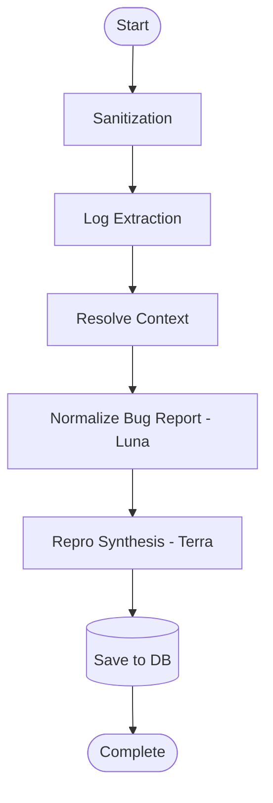

# Operations Runbook: Game Bug Analysis Pipeline

This document defines the troubleshooting runbook, monitoring rules, observability signals, and mitigation strategies for the Game Bug Report Agent backend analysis pipeline.

## 1. Pipeline Stages & Observability

The analysis pipeline executes in a series of stages, logging state transitions with the structured property `Stage`. Monitoring dashboards and alerts should track transitions and latency per stage.



### Stage Trace Properties
All structured logs emit the following contextual properties:
- `AnalysisRunId`: Unique identifier of the execution run.
- `BugReportId`: The source bug report being analyzed.
- `Stage`: The current executing phase (e.g., `Sanitization`, `LogExtraction`, `ContextResolution`, `NormalizeBugReport`, `ReproSynthesis`).
- `Provider`: The AI provider resolved (`OpenAI` for the Phase 2 routes).
- `Model`: The AI model version resolved.

---

## 2. Metrics & Alerting Thresholds

We track pipeline health using the following prometheus-compatible metrics:

| Metric Name | Type | Labels | Description / Alert Trigger |
|-------------|------|--------|-----------------------------|
| `analysis_stage_duration_seconds` | Histogram | `stage`, `status` | Alert if 95th percentile of AI model stages exceeds 45s. |
| `analysis_ai_execution_tokens_total` | Counter | `provider`, `model`, `type` | Monitor input/output token usage per hour for cost management. |
| `analysis_run_failures_total` | Counter | `error_code` | Alert if failure rate > 5% within 10 minutes. |
| `analysis_warning_count` | Counter | `warning_code` | Tracks warning frequency (e.g., `CONTEXT_CONFLICT`). |

---

## 3. Trouble Shooting & Remediation Paths

### Error Code: `INVALID_AI_SCHEMA`
* **Symptom**: The AI model failed to produce a JSON response conforming to the required schema after the configured max attempts.
* **Impact**: The analysis run fails with `AnalysisStatus.Failed`.
* **Diagnostics**:
  1. Search logs for: `Stage="ReproSynthesis"` and `ExceptionMessage` or schema error logs.
  2. Inspect the raw AI response in the `analysis_ai_executions` database table for the matching `AnalysisRunId`.
* **Remediation**:
  - If the model is outputting markdown formatting (e.g., ```json ... ```), ensure the gateway parser is cleaning it.
  - If the model is failing to supply mandatory fields like `ExpectedResult` or `Steps`, check if the system instructions/schema version configuration was recently changed. Consider rolling back the model/prompt version in the Routing Policy.

### Warning Code: `CONTEXT_CONFLICT`
* **Symptom**: An entity mentioned in the log or description is incompatible with the resolved build version or platform.
* **Impact**: The run completes successfully but contains warnings indicating that the context is unaligned (e.g., log states version `1.5` but entity was introduced in `1.8`).
* **Remediation**:
  - Usually no immediate operational action is required as the pipeline downgrades step verification automatically.
  - If warnings are incorrect, check the regex aliases and build range entries for the entity in the Game Context database.

### Error Code: `AI_GATEWAY_TIMEOUT` / `RATE_LIMIT`
* **Symptom**: The gateway returns an API connection timeout or HTTP 429.
* **Impact**: Append-only execution attempt is recorded as failed. Pipeline will retry up to configured limit.
* **Remediation**:
  - Verify API Key quota status on Google AI Studio / Vertex AI console.
  - Scale down concurrent requests or update routing settings to use a failover model provider.
